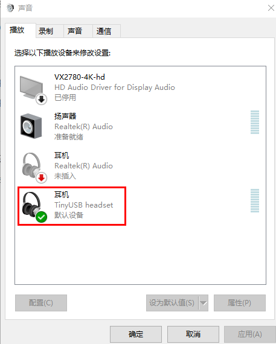
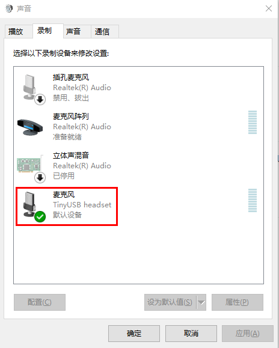
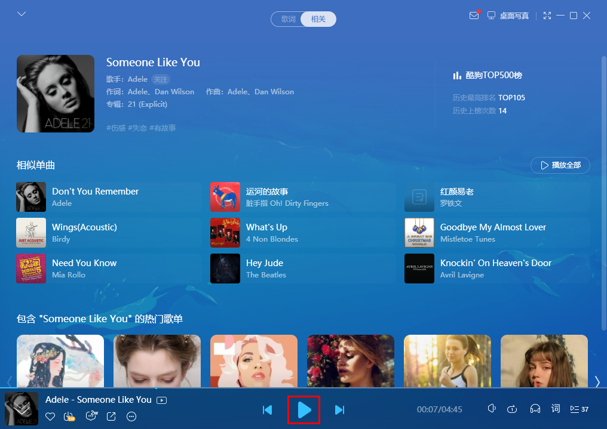
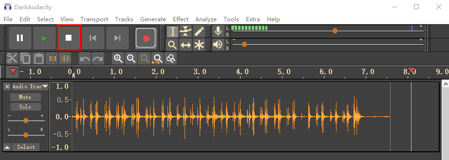

# UAC2 Speaker and Microphone

## Overview

This  example project shows USB hid generic transfers

- PC transmits a HID report to MCU,  and then MC send it back to PC

## Board Setting

- Connect a USB port on PC to the PWR DEBUG port on the development board with a USB Type-C cable
- Connect a USB port on PC to one of USB port on the development board with a USB Type-C cable
- Connect a speaker to the DAO interface on the development board

## Project Configuration

- File `CMakeLists.txt`：

  When BOARD_DEVICE_RHPORT_NUM is defined as 0, it means to use USB0.

  When BOARD_DEVICE_RHPORT_NUM is defined as 1, it means to use USB1.
- The property of USB device can be configured by "tusb_config.h" or "CMakeListx.txt"

## Running the example

When the project runs correctly

- Confirm the audio settings:

  (1) Set "TinyUSB headset" as the default play device

  

  (2) Set "TinyUSB headset" as the default recording device

  

- Play

  (1) Start a music player on PC and choose a music song,  and then click "Play" button

  ​	  

  (2) MCU plays music by speaker as receiving audio data from PC.

- Recording

  (1) Stop the music player on PC

  (2) Start a recording tool and click "Record" button, and at the same time play a music song by another player device(e.g. mobile phone)

  

  (3) Click "Stop" button after recording for a while

  

  (4) Click "Play" button

  

  (5) MCU Plays audio by speaker on DAO interface

